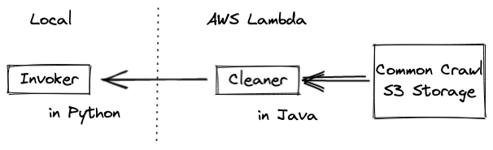

# Introduction
* You would find a bunch of common crawl projects [HERE](https://commoncrawl.org/the-data/examples/)
* However, nobody use AWS Lambda + Java to achieve both local-storage performance and low pricing (rectify if it's wrong)
* So, the key idea is
    1) Deploy a micro service **on AWS Lambda** to do some basic download, untar & cleaning job, then  
    2) invoke the service and fetch back the cleaned data **on local computer**.  

# AWS setup
* Deploy the compiled `java.zip` to AWS Lambda ([ALSO SEE](java/README.md));  
  * Remember your functionARN

# To Run
Setting up your own credential:  
  * [AWS Doc](https://boto3.amazonaws.com/v1/documentation/api/latest/guide/credentials.html)  

  * The easiest way to setup:
    1. generate a credential in [AWS Console](https://console.aws.amazon.com/iam/home?region=us-east-1#/security_credentials)
    2. install AWS CLI https://aws.amazon.com/cn/cli/
    3. generate the config file via `$ aws configure`

Preparations:  
  * Download S3 path file from [Common Crawl](https://commoncrawl.org/the-data/get-started/)
  * Setup your own confg in `config.py`
    * Carefully setup `MaxConcurrent`
  * `pip install -r requirements.txt`

Run:
  * `python invoke.py`